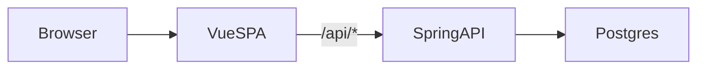
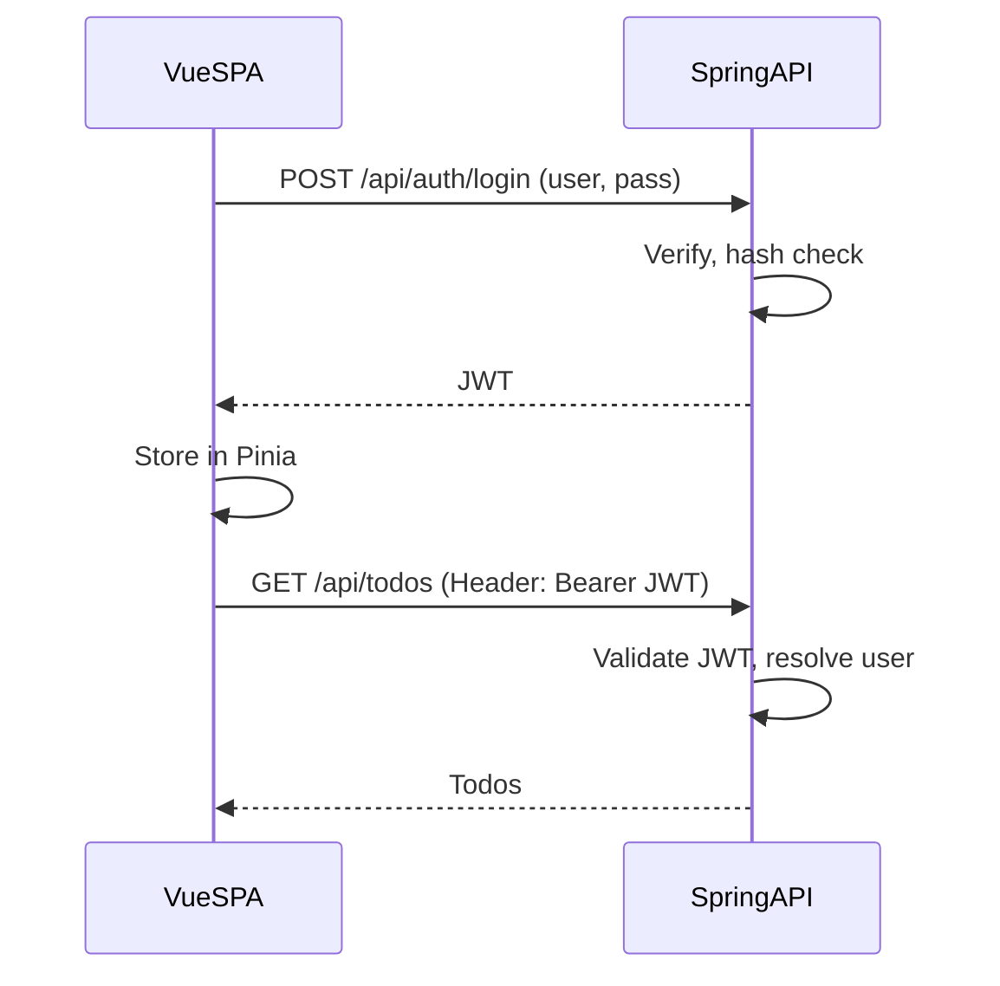

# Spring/Vue TODO — Design

Rules, guidelines, architecture, and diagrams for the Spring/Vue TODO monolith.

---

## Scope / YAGNI

- **In scope**: A single TODO list per user; basic username/password authentication only.
- **Out of scope (for now)**: Roles, RBAC, password reset, "remember me," multiple lists, tags, due dates, SSR, SEO. Defer everything else.

---

## Stack

| Layer   | Tech |
|---------|------|
| Frontend | Vue 3 (TypeScript), Pinia, Vite |
| Backend  | Spring Boot 3 (Java 17+), Spring Data JPA, Spring Security, Flyway |
| Database | PostgreSQL |

---

## Diagrams

### Request flow

High-level path for a typical request: browser → Vue SPA → Spring API → Postgres.



### Auth flow

Login and subsequent authenticated requests. The SPA stores the JWT in Pinia and sends it on each API call.



---

## Delivery

- **Production**: One deployable artifact. Run `./build.sh`, then `./run.sh`. Spring serves the built Vue app from `/` and exposes a JSON API under `/api`. Same origin for SPA and API. Open <http://localhost:8080>.
- **Development** can run in two ways:
  - **Monolith (one process)**: Run the backend only with the dev profile: `./run.sh -Dspring-boot.run.profiles=dev`. The app is served from Spring at <http://localhost:8080>. The frontend must be built at least once (e.g. run `./build.sh`, then `./run.sh`). Rebuild the frontend when you change frontend code; there is no hot reload. This matches the case where the frontend has no `dev` script.
  - **Two-process (optional)**: If the frontend defines a `dev` script (e.g. `"dev": "vite"`), run the backend with `./run.sh -Dspring-boot.run.profiles=dev` and the frontend with `cd frontend && pnpm dev`. The Vite dev server proxies `/api` to the backend (see `vite.config.ts`). Use the Vite URL (e.g. <http://localhost:5173>) for hot reload.

---

## Auth

- Username and password only. No roles or permissions.
- Token-based (e.g. JWT). The SPA sends the token in a header; no cookies required for API auth.
- Logout is client-side only when using stateless JWT (clear token from Pinia). No server-side session or token blacklist in the minimal design.

---

## Data

- **User**: id, username, password hash (BCrypt), createdAt. Used only for authentication.
- **Todo**: id, title, completed, createdAt, userId (FK to User). All todo access is scoped by the authenticated user.
- **Dev seed**: With the `dev` profile, `DevDataLoader` creates user `user` / password `password` on first run if no user exists. Use for local development only.

---

## Schema / Flyway

**Stipulation:** Database schema is managed by **Flyway**, not Hibernate.

- Migrations live under `backend/src/main/resources/db/migration/` (e.g. `V1__create_tables.sql`). Flyway runs them on startup in version order.
- JPA uses `spring.jpa.hibernate.ddl-auto: validate`. Hibernate does **not** create or alter tables; it only checks that entity mappings match the existing schema.
- **Any schema change** (new table, column, index, FK) **must** be done via a new Flyway migration (e.g. `V2__add_foo.sql`). Do not rely on `ddl-auto: update` or hand-edit the DB.
- Keep migrations and JPA entities in sync: migrations define the source of truth, entities must match.

This gives deterministic, versioned schema evolution, ensures the dev seed runs against existing tables, and keeps production upgrades reproducible.

**PostgreSQL 15+**: The `public` schema no longer grants create to all roles by default. The app DB user (e.g. `springvue`) must have `GRANT ALL ON SCHEMA public` and `GRANT CREATE ON SCHEMA public`. Run these as a superuser (e.g. `sudo -u postgres psql`) in the target database. See README → Database for the exact SQL.

### Querying the database (psql)

To inspect data via the CLI, connect with `psql` using the same host, port, database, and credentials as the app (see `application.yml`; defaults: host `localhost`, port `5432`, database `springvue`, user `springvue`, password `springvue`):

```bash
psql -h localhost -p 5432 -U springvue -d springvue
```

Supply the password when prompted, or non-interactively:

```bash
PGPASSWORD=springvue psql -h localhost -p 5432 -U springvue -d springvue
```

Useful commands and queries once connected:

- List tables: `\dt`
- Describe a table: `\d users` or `\d todos`
- List users: `SELECT id, username, created_at FROM users;`
- List todos with owner: `SELECT t.id, t.title, t.completed, t.created_at, u.username FROM todos t JOIN users u ON t.user_id = u.id ORDER BY t.created_at DESC;`
- Run a one-off query from the shell: `PGPASSWORD=springvue psql -h localhost -p 5432 -U springvue -d springvue -c "SELECT * FROM users;"`
- Quit: `\q`

### Clearing the database

**Wipe data, keep schema** (dev reset): truncate tables so Flyway schema stays and you can re-seed. From the shell:

```bash
PGPASSWORD=springvue psql -h localhost -p 5432 -U springvue -d springvue -c "TRUNCATE todos CASCADE; TRUNCATE users CASCADE;"
```

If truncation fails due to FK order, run `TRUNCATE todos;` then `TRUNCATE users;` in separate `-c` invocations.

**Full reset** (drop and recreate DB): removes schema and data. Requires superuser and no active connections to `springvue`. Terminate backends, then drop and recreate:

```bash
sudo -u postgres psql -c "SELECT pg_terminate_backend(pid) FROM pg_stat_activity WHERE datname = 'springvue' AND pid <> pg_backend_pid();"
sudo -u postgres psql -c "DROP DATABASE springvue;"
sudo -u postgres psql -c "CREATE DATABASE springvue OWNER springvue;"
```

Re-run the README → Database grants on `public` for the `springvue` user. On next app start, Flyway recreates tables.

### Freeing ports

To free a port so another app can bind to it:

- **Port 8080 (Spring Boot)**: Stop the process that started via `./run.sh` (Ctrl+C in that terminal). If it’s elsewhere, find it with `lsof -i :8080` or `ss -tlnp | grep 8080`, then `kill <PID>`, or run `pkill -f "spring-boot:run"`.
- **Port 5432 (PostgreSQL)**: Stop the Postgres server. How depends on install: `systemctl stop postgresql` (or `postgresql@15` etc.), or `brew services stop postgresql@15` on macOS, or the `pg_ctl stop` equivalent for your setup.

---

## Entities

JPA entities in `dev.springvue.entity` map to the tables defined by Flyway. Schema is the source of truth; entity mappings must stay in sync (see Schema / Flyway).

- **User** (`entity/User.java`): table `users`. Fields: `id` (PK, identity), `username` (unique, non-null), `passwordHash` (non-null), `createdAt` (non-null, updatable = false). `@PrePersist` sets `createdAt` to `Instant.now()`.

- **Todo** (`entity/Todo.java`): table `todos`. Fields: `id` (PK, identity), `title` (non-null), `completed` (non-null, default false), `createdAt` (non-null, updatable = false), `userId` (non-null, column `user_id`). `@PrePersist` sets `createdAt` to `Instant.now()`.

---

## Repositories

Not git repositories. Think database repositories.

Spring Data JPA repositories in `dev.springvue.repository` extend `JpaRepository`. Controllers and auth use them for persistence; todo access is always scoped by the authenticated user.

- **UserRepository** (`repository/UserRepository.java`): `Optional<User> findByUsername(String username)`. Used by login to resolve a user by username.

- **TodoRepository** (`repository/TodoRepository.java`): `List<Todo> findByUserIdOrderByCreatedAtDesc(Long userId)`. Returns a user’s todos newest-first. The todo controller uses this with the authenticated user’s id so users only see their own todos.

---

## Web

REST controllers and request/response DTOs in `dev.springvue.web`. All `/api/**` endpoints are authenticated except `POST /api/auth/login` (see Security).

### Controllers

- **AuthController** (`web/AuthController.java`): `@RestController` `@RequestMapping("/api/auth")`. `POST /login` accepts `LoginRequest` (username, password); returns 400 if either is null or blank. Looks up user by username, checks password with `PasswordEncoder`, issues JWT via `JwtService`, returns `LoginResponse` (token, username). Returns 401 if user not found or password does not match.
- **TodoController** (`web/TodoController.java`): `@RestController` `@RequestMapping("/api/todos")`. All handlers resolve the current user from `Authentication` via `UserRepository.findByUsername(auth.getName())`; unauthenticated or unknown user yields 401 or empty list. `GET /` → list todos for current user (newest-first). `POST /` → create todo from `CreateTodoRequest.title`, 400 if title null/blank. `GET /{id}`, `PUT /{id}`, `DELETE /{id}` → get/update/delete only if the todo belongs to the current user; 404 otherwise. Uses `TodoDto` for responses.

### Request / response DTOs

- **LoginRequest** (`web/LoginRequest.java`): `username`, `password`. Jackson `@JsonCreator` / `@JsonProperty` for deserialization.
- **LoginResponse** (`web/LoginResponse.java`): `token`, `username`. Returned by successful login.
- **CreateTodoRequest** (`web/CreateTodoRequest.java`): `title`. Body for `POST /api/todos`.
- **UpdateTodoRequest** (`web/UpdateTodoRequest.java`): `title`, `completed` (both optional). Body for `PUT /api/todos/{id}`; only non-null fields are applied (blank title is ignored).
- **TodoDto** (`web/TodoDto.java`): `id`, `title`, `completed`, `createdAt`. Used in todo API responses; `TodoDto.from(Todo)` builds from entity.

---

## Frontend state

**Stipulation:** Todos are used on a single screen only. Use **local component state** (e.g. `ref` in the todo view), not a global store.

- **Pinia** is for app-wide state only: auth (token, username). The API client and router guard read from the auth store.
- **Todos** are fetched and mutated in the todo view via the API client; no Pinia store for todos.

---

## Styling (scoped vs non-scoped)

In Vue single-file components, `<style>` blocks can be **scoped** or **non-scoped** (global).

### Scoped (`<style scoped>`)

- CSS applies only to elements in *this* component’s template.  
- Vue does this by adding a unique data attribute (e.g. `data-v-7ba5bd90`) to the component’s root and descendants, and rewriting selectors so they target that attribute (e.g. `.foo` → `.foo[data-v-7ba5bd90]`).  
- Use for component-specific layout, typography, and visuals so they don’t affect other views or leak into child components’ content.  
- **Default choice** for component styles in this project.

### Non-scoped (global) (`<style>` without `scoped`)

- CSS is emitted as-is and affects the whole app.  
- Use for shared resets, design tokens, or base styles (e.g. in `App.vue` or a shared layout) that are meant to apply everywhere.  
- Avoid for view- or component-specific rules; they’re hard to reason about and can accidentally override other components.

**Guideline:** Prefer `<style scoped>` in views and components. Use a small number of global `<style>` blocks only for app-wide base styles. App-wide base styles live in `frontend/src/assets/` (e.g. `main.css`, `base.css`) and are imported in `main.ts`; components use `<style scoped>`. Don’t rely on deep selectors (e.g. `:deep()`) unless you have a clear reason; they weaken encapsulation.

---

## Security

**Stipulations:**

- **JWT secret**: Never commit production secrets. Use env vars or a secret manager (e.g. `APP_JWT_SECRET`). When building the HS256 key, require at least 32 bytes (256 bits); fail fast at startup if the secret is too short. In production, fail startup if the resolved secret equals the default dev secret (so prod cannot run with an unset or default secret).
- **Rate limiting**: Throttle `POST /api/auth/login` (e.g. per IP). Optionally throttle other `/api/**` endpoints. Use Bucket4j, Resilience4j, or a reverse-proxy; document the approach.
- **CORS**: When the frontend is served from a different origin than the API, configure CORS on the backend for explicit allowed origins only. When SPA and API share an origin, no CORS config is required.
- **XSS**: Render user-generated content as text only. Do not use `v-html` (or equivalent) with unsanitized data. Vue’s default `{{ }}` escaping is sufficient as long as raw HTML is not introduced.
- **Input validation**: Enforce bounds on the backend (e.g. max length for todo title, Bean Validation / JSR 380 on DTOs). Use `@Valid` on request bodies so invalid input is rejected before business logic. Keep JPA column lengths in sync (e.g. `@Column(length = 500)`).
- **Login timing** (optional): For higher assurance against user enumeration, use constant-time login—e.g. always run BCrypt (e.g. against a dummy hash when the user is not found) so response time does not leak “user exists” vs “wrong password.”

### Implementation (dev.springvue)

- **SecurityConfig** (`config/SecurityConfig.java`): Defines two filter chains. (1) For `/api/**`: stateless sessions; `POST /api/auth/login` permitted anonymously; all other `/api/**` require authentication; CSRF disabled; `JwtAuthFilter` runs before `UsernamePasswordAuthenticationFilter`. (2) For `/**`: catches everything else and permits all (SPA static and fallback). Provides a `PasswordEncoder` bean (BCrypt).
- **JwtAuthFilter** (`security/JwtAuthFilter.java`): `OncePerRequestFilter` that reads `Authorization: Bearer <token>`, validates the token via `JwtService`, and on success sets `SecurityContextHolder` with an `UsernamePasswordAuthenticationToken` whose principal is the username (no authorities). Invalid or missing tokens leave the context unauthenticated; the filter always continues the chain.
- **JwtService** (`security/JwtService.java`): Builds an HMAC key from `JwtProperties.getSecret()`; `generateToken(username)` issues a JWT with subject, issuedAt, expiration; `getUsernameFromToken(token)` verifies and returns the subject. Does not enforce secret length or reject the default dev secret (see stipulations above).
- **JwtProperties** (`config/JwtProperties.java`): `@ConfigurationProperties(prefix = "app.jwt")`. Binds `app.jwt.secret` and `app.jwt.expiration-ms` (default 86400000). Consumed by `JwtService` for signing and expiry.

---

## Conventions

- **API**: JSON only. REST-style CRUD for todos. Auth: `POST /api/auth/login`, client-side logout (no required `/api/auth/logout` call when JWT is stateless). The frontend API client uses base URL `/api` and relative paths (e.g. `/todos`, `/auth/login`); see `frontend/src/api/client.ts`.
- **Routes**: All app "routes" are client-side (Vue Router). The server serves a single `index.html` for the app; it does not define route-level endpoints for the SPA. Implemented routes: `/` (todo list, `meta.requiresAuth: true`), `/login`. The router guard redirects unauthenticated users from `/` to `/login`.
- **Config**: Secrets (DB URL/user/password, JWT secret) via env vars or `application-local.yml` (profile `local`). Defaults in `application.yml` are for local dev only; see README → Config & secrets.
- **Scripts**: From project root, `./run.sh [args]` runs the backend (e.g. `./run.sh -Dspring-boot.run.profiles=dev` for dev profile). `./build.sh` runs frontend install and build, then copies `frontend/dist/*` into `backend/src/main/resources/static/`. Neither script is required—you can run Maven from `backend/` and build/copy manually—but they keep the common flows one-command.
- **Frontend build**: The frontend build script may be sequential (e.g. `vue-tsc --build && vite build`) or parallel (e.g. `run-p type-check "build-only {@}" --`). Parallel run scripts and their dependency (e.g. `npm-run-all2`) are optional.

---

## Architecture

The browser loads the Vue SPA once. The SPA renders views and, when it needs data, calls the Spring backend under `/api`. Spring handles auth (e.g. JWT validation), talks to PostgreSQL, and returns JSON. There are no server-rendered pages; the only HTML the server returns for the app is the SPA's `index.html`.

**Dev**: Either (a) one process—Spring serves pre-built static from `static/`, you rebuild frontend when it changes—or (b) two processes—Vite serves the app and proxies `/api` to Spring, for hot reload. See Delivery → Development.

**Prod**: The frontend is built to static files, those files are copied into `backend/src/main/resources/static/`, and Spring serves them. Any non-API path falls back to `index.html` so client-side routing works (see `SpaConfig`).

---

## Scale (high concurrency and large datasets)

The system is intended to support high concurrency and very large datasets. The following stipulations apply when designing and evolving the stack.

### Database

- **Connection pooling**: Use HikariCP (default in Spring Boot). Tune `maximum-pool-size` per instance so (instances × pool size) stays below Postgres `max_connections`. Use a connection pooler (e.g. PgBouncer) in front of Postgres when many app instances share the DB.
- **Pagination**: List APIs must never return unbounded result sets. Use **keyset (cursor) pagination** on a stable ordering (e.g. `(created_at, id)`) instead of `OFFSET`, so cost stays constant as data grows. Example: `WHERE user_id = ? AND (created_at, id) < (?, ?) ORDER BY created_at DESC, id DESC LIMIT N`.
- **Indexes**: Maintain composite indexes that match list and filter access patterns (e.g. `(user_id, created_at DESC, id)` for keyset-paged lists). Add indexes for any new filters or sort orders.
- **Partitioning**: For very large tables, partition by a key (e.g. `user_id`) or by time. Keep the “hot” partition small; same JPA entities, schema and query patterns change.
- **Read replicas**: Route read-only, user-scoped queries to replicas via a **routing datasource** (or multi-datasource). Writes stay on the primary. Use when read load justifies it.
- **Archiving**: Move old or completed rows into archive tables or cold storage so the main table stays small and fast.

### Backend (Spring)

- **Stateless + horizontal scale**: JWT and stateless auth are retained so adding app instances behind a load balancer requires no session affinity.
- **Virtual threads**: Prefer **virtual threads** (Java 21+) for higher concurrency per instance before introducing reactive (WebFlux). Keep Spring MVC; enable virtual threads and align connection pool and thread usage.
- **Caching**: Cache “username → userId” (or embed `userId` in the JWT) to avoid a DB round-trip on every request for user resolution. Use Redis (or equivalent) when multiple instances must share cache. Optionally cache first page or counts per user with short TTLs and invalidation on writes.
- **Backpressure and limits**: Use **rate limiting** (e.g. Bucket4j, Resilience4j, or gateway) so traffic spikes don’t overload the DB or app. Apply **timeouts and circuit breakers** on outbound calls (DB, cache, etc.).
- **Observability**: Under load, **metrics** (latency, throughput, errors), **tracing** (e.g. OpenTelemetry), and **structured logs** are required so bottlenecks can be found and tuned. Use before and after load tests.

### Frontend (Vue)

- **Pagination in the UI**: Never request or render “all” items for large datasets. The API returns pages; the frontend requests the next page (e.g. “Load more” or infinite scroll).
- **Virtual scrolling**: When a single page can contain hundreds of rows, use **virtual scrolling** (e.g. vue-virtual-scroller or equivalent) so only visible rows exist in the DOM. Keeps rendering fast with large result sets.

### Order of operations

When evolving toward high concurrency and large data, apply in roughly this order:

1. **Pagination** (keyset) and matching indexes; remove any “load all” list APIs.
2. **Caching** (or `userId` in JWT) to cut per-request DB load.
3. **Connection tuning** and, if needed, a pooler (e.g. PgBouncer).
4. **Virtual threads** (Java 21+) for more concurrency per instance.
5. **Read replicas + routing** when read load justifies it.
6. **Partitioning and archiving** when a single table or partition is too large.
7. **Rate limiting and observability** in parallel so the system can be measured and protected.

---
