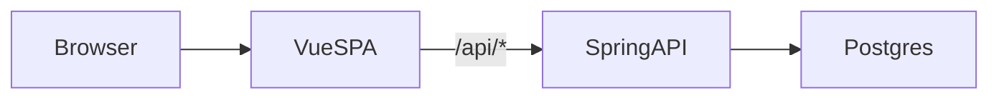
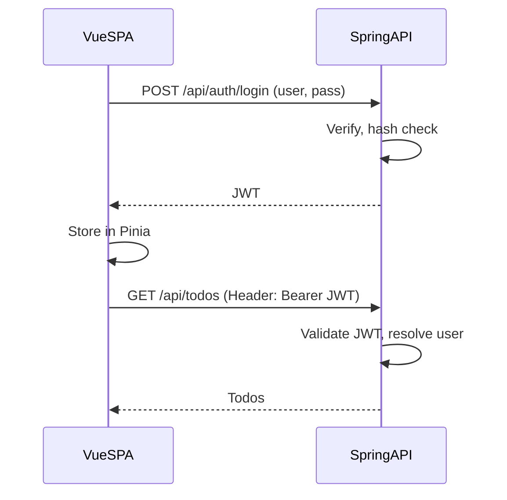

# Spring/Vue TODO — Design

Rules, guidelines, architecture, and diagrams for the Spring/Vue TODO monolith.

---

## Scope / YAGNI

- **In scope**: A single TODO list per user; basic username/password authentication only.
- **Out of scope (for now)**: Roles, RBAC, password reset, "remember me," multiple lists, tags, due dates, SSR, SEO. Defer everything else.

---

## Stack

| Layer   | Tech |
|---------|------|
| Frontend | Vue 3 (TypeScript), Pinia, Vite |
| Backend  | Spring Boot 3 (Java 17+), Spring Data JPA, Spring Security |
| Database | PostgreSQL |

---

## Delivery

- **Production**: One deployable artifact. Spring serves the built Vue app from `/` and exposes a JSON API under `/api`. Same origin for SPA and API.
- **Development**: Two processes—Vite dev server for the frontend, Spring Boot for the API. The frontend dev server proxies `/api` to the backend so the SPA talks to Spring without CORS.

---

## Auth

- Username and password only. No roles or permissions.
- Token-based (e.g. JWT). The SPA sends the token in a header; no cookies required for API auth.
- Logout is client-side only when using stateless JWT (clear token from Pinia). No server-side session or token blacklist in the minimal design.

---

## Data

- **User**: id, username, password hash (BCrypt), createdAt. Used only for authentication.
- **Todo**: id, title, completed, createdAt, userId (FK to User). All todo access is scoped by the authenticated user.

---

## Conventions

- **API**: JSON only. REST-style CRUD for todos. Auth: `POST /api/auth/login`, client-side logout (no required `/api/auth/logout` call when JWT is stateless).
- **Routes**: All app "routes" are client-side (Vue Router). The server serves a single `index.html` for the app; it does not define route-level endpoints for the SPA.

---

## Architecture

The browser loads the Vue SPA once. The SPA renders views and, when it needs data, calls the Spring backend under `/api`. Spring handles auth (e.g. JWT validation), talks to PostgreSQL, and returns JSON. There are no server-rendered pages; the only HTML the server returns for the app is the SPA's `index.html`.

**Dev**: The Vue dev server (Vite) serves the app and proxies `/api` to the Spring process. You run backend and frontend separately.

**Prod**: The frontend is built to static files, those files are served by Spring (e.g. from `static/`), and any non-API path falls back to `index.html` so client-side routing works.

---

## Diagrams

### Request flow

High-level path for a typical request: browser → Vue SPA → Spring API → Postgres.

### Auth flow

Login and subsequent authenticated requests. The SPA stores the JWT in Pinia and sends it on each API call.

