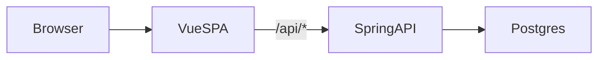
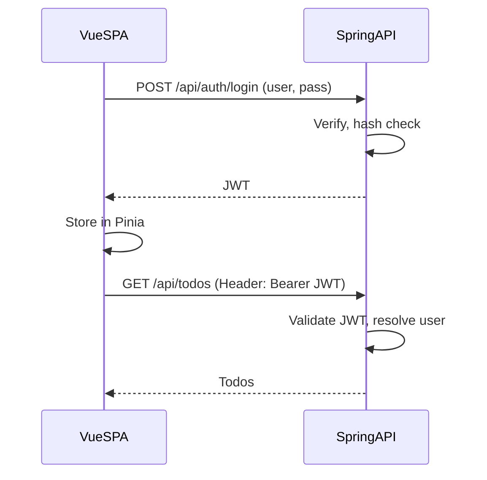

# Spring/Vue TODO — Design

Rules, guidelines, architecture, and diagrams for the Spring/Vue TODO monolith.

---

## Scope / YAGNI

- **In scope**: A single TODO list per user; basic username/password authentication only.
- **Out of scope (for now)**: Roles, RBAC, password reset, "remember me," multiple lists, tags, due dates, SSR, SEO. Defer everything else.

---

## Stack

| Layer   | Tech |
|---------|------|
| Frontend | Vue 3 (TypeScript), Pinia, Vite |
| Backend  | Spring Boot 3 (Java 17+), Spring Data JPA, Spring Security, Flyway |
| Database | PostgreSQL |

---

## Delivery

- **Production**: One deployable artifact. Run `./build.sh`, then `./run.sh`. Spring serves the built Vue app from `/` and exposes a JSON API under `/api`. Same origin for SPA and API. Open http://localhost:8080.
- **Development** can run in two ways:
  - **Monolith (one process)**: Run the backend only with the dev profile: `./run.sh -Dspring-boot.run.profiles=dev`. The app is served from Spring at http://localhost:8080. The frontend must be built at least once (e.g. run `./build.sh`, then `./run.sh`). Rebuild the frontend when you change frontend code; there is no hot reload. This matches the case where the frontend has no `dev` script.
  - **Two-process (optional)**: If the frontend defines a `dev` script (e.g. `"dev": "vite"`), run the backend with `./run.sh -Dspring-boot.run.profiles=dev` and the frontend with `cd frontend && pnpm dev`. The Vite dev server proxies `/api` to the backend (see `vite.config.ts`). Use the Vite URL (e.g. http://localhost:5173) for hot reload.

---

## Auth

- Username and password only. No roles or permissions.
- Token-based (e.g. JWT). The SPA sends the token in a header; no cookies required for API auth.
- Logout is client-side only when using stateless JWT (clear token from Pinia). No server-side session or token blacklist in the minimal design.

---

## Data

- **User**: id, username, password hash (BCrypt), createdAt. Used only for authentication.
- **Todo**: id, title, completed, createdAt, userId (FK to User). All todo access is scoped by the authenticated user.
- **Dev seed**: With the `dev` profile, `DevDataLoader` creates user `user` / password `password` on first run if no user exists. Use for local development only.

---

## Schema / Flyway

**Stipulation:** Database schema is managed by **Flyway**, not Hibernate.

- Migrations live under `backend/src/main/resources/db/migration/` (e.g. `V1__create_tables.sql`). Flyway runs them on startup in version order.
- JPA uses `spring.jpa.hibernate.ddl-auto: validate`. Hibernate does **not** create or alter tables; it only checks that entity mappings match the existing schema.
- **Any schema change** (new table, column, index, FK) **must** be done via a new Flyway migration (e.g. `V2__add_foo.sql`). Do not rely on `ddl-auto: update` or hand-edit the DB.
- Keep migrations and JPA entities in sync: migrations define the source of truth, entities must match.

This gives deterministic, versioned schema evolution, ensures the dev seed runs against existing tables, and keeps production upgrades reproducible.

**PostgreSQL 15+**: The `public` schema no longer grants create to all roles by default. The app DB user (e.g. `springvue`) must have `GRANT ALL ON SCHEMA public` and `GRANT CREATE ON SCHEMA public`. Run these as a superuser (e.g. `sudo -u postgres psql`) in the target database. See README → Database for the exact SQL.

---

## Frontend state

**Stipulation:** Todos are used on a single screen only. Use **local component state** (e.g. `ref` in the todo view), not a global store.

- **Pinia** is for app-wide state only: auth (token, username). The API client and router guard read from the auth store.
- **Todos** are fetched and mutated in the todo view via the API client; no Pinia store for todos.

---

## Styling (scoped vs non-scoped)

In Vue single-file components, `<style>` blocks can be **scoped** or **non-scoped** (global).

**Scoped (`<style scoped>`)**  
- CSS applies only to elements in *this* component’s template.  
- Vue does this by adding a unique data attribute (e.g. `data-v-7ba5bd90`) to the component’s root and descendants, and rewriting selectors so they target that attribute (e.g. `.foo` → `.foo[data-v-7ba5bd90]`).  
- Use for component-specific layout, typography, and visuals so they don’t affect other views or leak into child components’ content.  
- **Default choice** for component styles in this project.

**Non-scoped (global) (`<style>` without `scoped`)**  
- CSS is emitted as-is and affects the whole app.  
- Use for shared resets, design tokens, or base styles (e.g. in `App.vue` or a shared layout) that are meant to apply everywhere.  
- Avoid for view- or component-specific rules; they’re hard to reason about and can accidentally override other components.

**Guideline:** Prefer `<style scoped>` in views and components. Use a small number of global `<style>` blocks only for app-wide base styles. App-wide base styles live in `frontend/src/assets/` (e.g. `main.css`, `base.css`) and are imported in `main.ts`; components use `<style scoped>`. Don’t rely on deep selectors (e.g. `:deep()`) unless you have a clear reason; they weaken encapsulation.

---

## Security

**Stipulations:**

- **JWT secret**: Never commit production secrets. Use env vars or a secret manager (e.g. `APP_JWT_SECRET`). When building the HS256 key, require at least 32 bytes (256 bits); fail fast at startup if the secret is too short. In production, fail startup if the resolved secret equals the default dev secret (so prod cannot run with an unset or default secret).
- **Rate limiting**: Throttle `POST /api/auth/login` (e.g. per IP). Optionally throttle other `/api/**` endpoints. Use Bucket4j, Resilience4j, or a reverse-proxy; document the approach.
- **CORS**: When the frontend is served from a different origin than the API, configure CORS on the backend for explicit allowed origins only. When SPA and API share an origin, no CORS config is required.
- **XSS**: Render user-generated content as text only. Do not use `v-html` (or equivalent) with unsanitized data. Vue’s default `{{ }}` escaping is sufficient as long as raw HTML is not introduced.
- **Input validation**: Enforce bounds on the backend (e.g. max length for todo title, Bean Validation / JSR 380 on DTOs). Use `@Valid` on request bodies so invalid input is rejected before business logic. Keep JPA column lengths in sync (e.g. `@Column(length = 500)`).
- **Login timing** (optional): For higher assurance against user enumeration, use constant-time login—e.g. always run BCrypt (e.g. against a dummy hash when the user is not found) so response time does not leak “user exists” vs “wrong password.”

---

## Conventions

- **API**: JSON only. REST-style CRUD for todos. Auth: `POST /api/auth/login`, client-side logout (no required `/api/auth/logout` call when JWT is stateless). The frontend API client uses base URL `/api` and relative paths (e.g. `/todos`, `/auth/login`); see `frontend/src/api/client.ts`.
- **Routes**: All app "routes" are client-side (Vue Router). The server serves a single `index.html` for the app; it does not define route-level endpoints for the SPA. Implemented routes: `/` (todo list, `meta.requiresAuth: true`), `/login`. The router guard redirects unauthenticated users from `/` to `/login`.
- **Config**: Secrets (DB URL/user/password, JWT secret) via env vars or `application-local.yml` (profile `local`). Defaults in `application.yml` are for local dev only; see README → Config & secrets.
- **Scripts**: From project root, `./run.sh [args]` runs the backend (e.g. `./run.sh -Dspring-boot.run.profiles=dev` for dev profile). `./build.sh` runs frontend install and build, then copies `frontend/dist/*` into `backend/src/main/resources/static/`. Neither script is required—you can run Maven from `backend/` and build/copy manually—but they keep the common flows one-command.
- **Frontend build**: The frontend build script may be sequential (e.g. `vue-tsc --build && vite build`) or parallel (e.g. `run-p type-check "build-only {@}" --`). Parallel run scripts and their dependency (e.g. `npm-run-all2`) are optional.

---

## Architecture

The browser loads the Vue SPA once. The SPA renders views and, when it needs data, calls the Spring backend under `/api`. Spring handles auth (e.g. JWT validation), talks to PostgreSQL, and returns JSON. There are no server-rendered pages; the only HTML the server returns for the app is the SPA's `index.html`.

**Dev**: Either (a) one process—Spring serves pre-built static from `static/`, you rebuild frontend when it changes—or (b) two processes—Vite serves the app and proxies `/api` to Spring, for hot reload. See Delivery → Development.

**Prod**: The frontend is built to static files, those files are copied into `backend/src/main/resources/static/`, and Spring serves them. Any non-API path falls back to `index.html` so client-side routing works (see `SpaConfig`).

---

## Diagrams

### Request flow

High-level path for a typical request: browser → Vue SPA → Spring API → Postgres.

### Auth flow

Login and subsequent authenticated requests. The SPA stores the JWT in Pinia and sends it on each API call.

