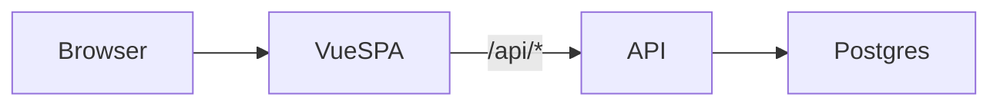
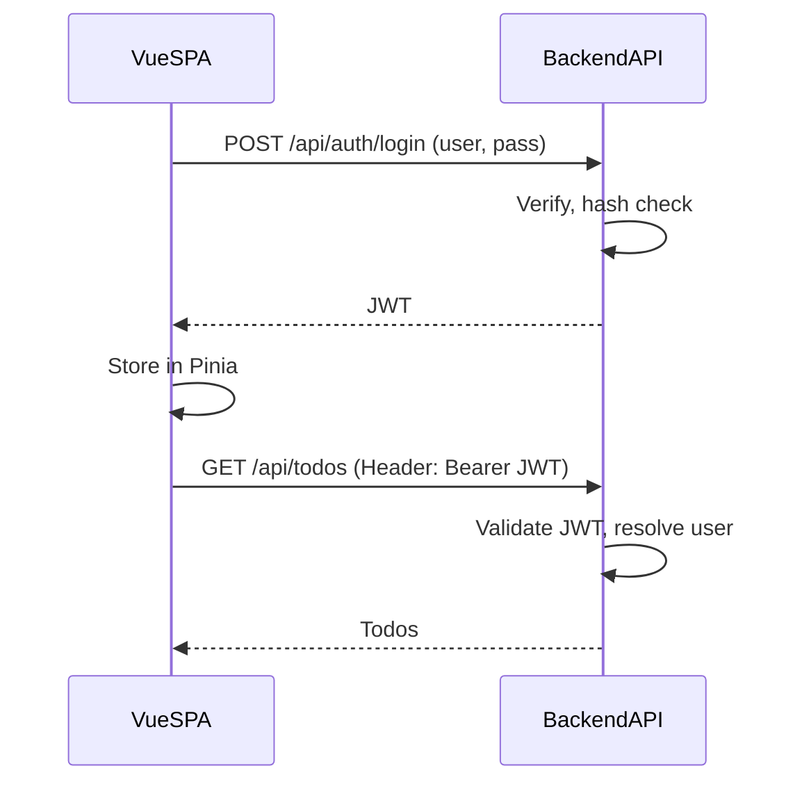

# Design — General

Shared scope, data model, API contract, frontend rules, security stipulations, and architecture for the TODO app. Backend-specific implementation lives in [Java](java.md) and [Rust](rust.md).

---

## Scope / YAGNI

- **In scope**: A single TODO list per user; basic username/password authentication only.
- **Out of scope (for now)**: Roles, RBAC, password reset, "remember me," multiple lists, tags, due dates, SSR, SEO. Defer everything else.

---

## Stack (high-level)

| Layer    | Tech |
|----------|------|
| Frontend | Vue 3 (TypeScript), Pinia, Vite |
| Backend  | Java (Spring Boot) or Rust (Actix); see [Java](java.md) / [Rust](rust.md) |
| Database | PostgreSQL |

---

## Diagrams

### Request flow

Browser → Vue SPA → API (`/api/*`) → Postgres.



### Auth flow

Login and subsequent authenticated requests. The SPA stores the JWT in Pinia and sends it on each API call.



---

## Auth

- Username and password only. No roles or permissions.
- Token-based (e.g. JWT). The SPA sends the token in a header; no cookies required for API auth.
- Logout is client-side only when using stateless JWT (clear token from Pinia). No server-side session or token blacklist in the minimal design.

---

## Data

- **User**: id, username, password hash (BCrypt), createdAt. Used only for authentication.
- **Todo**: id, title, completed, createdAt, userId (FK to User). All todo access is scoped by the authenticated user.
- **Dev seed**: In development, a seed user (e.g. `user` / `password`) is created if none exists. Backend-specific; see [Java](java.md) / [Rust](rust.md).

---

## Schema (canonical)

Both backends use the same tables. Migrations are managed per backend (Flyway for Java, sqlx for Rust).

```sql
CREATE TABLE public.users (
    id           BIGSERIAL PRIMARY KEY,
    username     VARCHAR(255) NOT NULL UNIQUE,
    password_hash VARCHAR(255) NOT NULL,
    created_at   TIMESTAMPTZ  NOT NULL
);

CREATE TABLE public.todos (
    id         BIGSERIAL PRIMARY KEY,
    title      VARCHAR(255) NOT NULL,
    completed  BOOLEAN      NOT NULL DEFAULT FALSE,
    created_at TIMESTAMPTZ  NOT NULL,
    user_id    BIGINT       NOT NULL REFERENCES public.users (id)
);

CREATE INDEX idx_todos_user_id ON public.todos (user_id);
```

**PostgreSQL 15+**: The `public` schema no longer grants create to all roles by default. The app DB user must have `GRANT ALL ON SCHEMA public` and `GRANT CREATE ON SCHEMA public`. Run these as a superuser; see README → Database for the exact SQL.

---

## API contract

All `/api/**` endpoints return JSON. The frontend ([`frontend/src/api/client.ts`](../frontend/src/api/client.ts)) uses base `/api` and relative paths.

- **Auth**: `POST /api/auth/login` — body `{ "username": "...", "password": "..." }` → `{ "token": "...", "username": "..." }`. **400** if missing/blank; **401** if bad credentials. Client-side logout only (no `/api/auth/logout`).
- **Todos**: REST-style CRUD. **401** if unauthenticated.
  - `GET /api/todos` → `[{ "id", "title", "completed", "createdAt" }, ...]` (newest first).
  - `POST /api/todos` — body `{ "title": "..." }` → created todo; **400** if title null/blank.
  - `GET /api/todos/:id` → single todo; **404** if not found or not owner.
  - `PUT /api/todos/:id` — body `{ "title"?, "completed"? }` (optional fields); **404** if not found or not owner.
  - `DELETE /api/todos/:id` → **204 No Content**; **404** if not found or not owner.

Use **camelCase** in JSON (e.g. `createdAt`). Backends must implement this contract so the Vue app works unchanged.

---

## Frontend state

**Stipulation:** Todos are used on a single screen only. Use **local component state** (e.g. `ref` in the todo view), not a global store.

- **Pinia** is for app-wide state only: auth (token, username). The API client and router guard read from the auth store.
- **Todos** are fetched and mutated in the todo view via the API client; no Pinia store for todos.

---

## Routes (Vue Router)

All app routes are client-side. The server serves a single `index.html` for the SPA; it does not define route-level endpoints. Implemented routes: `/` (todo list, `meta.requiresAuth: true`), `/login`. The router guard redirects unauthenticated users from `/` to `/login`.

---

## Styling (scoped vs non-scoped)

In Vue single-file components, `<style>` blocks can be **scoped** or **non-scoped** (global).

### Scoped (`<style scoped>`)

- CSS applies only to elements in *this* component’s template.
- Vue adds a unique data attribute and rewrites selectors. Use for component-specific layout and visuals.
- **Default choice** for component styles in this project.

### Non-scoped (global)

- CSS is emitted as-is and affects the whole app. Use for shared resets, design tokens, or base styles (e.g. in `App.vue` or `frontend/src/assets/`).
- Avoid for view- or component-specific rules.

**Guideline:** Prefer `<style scoped>` in views and components. Use a small number of global `<style>` blocks only for app-wide base styles. Don’t rely on `:deep()` unless you have a clear reason.

---

## Security (stipulations)

- **JWT secret**: Never commit production secrets. Use env vars or a secret manager (e.g. `APP_JWT_SECRET`). Require at least 32 bytes (256 bits) for HS256; fail fast at startup if too short. In production, fail startup if the resolved secret equals the default dev secret.
- **Rate limiting**: Throttle `POST /api/auth/login` (e.g. per IP). Optionally throttle other `/api/**` endpoints. Document the approach.
- **CORS**: When the frontend is served from a different origin than the API, configure CORS on the backend for explicit allowed origins only. When SPA and API share an origin, no CORS config is required.
- **XSS**: Render user-generated content as text only. Do not use `v-html` with unsanitized data. Vue’s default `{{ }}` escaping is sufficient.
- **Input validation**: Enforce bounds on the backend (e.g. max length for todo title). Reject invalid input before business logic.
- **Login timing** (optional): Use constant-time login (e.g. always run BCrypt, including against a dummy hash when the user is not found) so response time does not leak “user exists” vs “wrong password.”

Implementation details are backend-specific; see [Java](java.md) / [Rust](rust.md).

---

## Architecture

The browser loads the Vue SPA once. The SPA renders views and, when it needs data, calls the backend under `/api`. The backend handles auth (e.g. JWT validation), talks to PostgreSQL, and returns JSON. There are no server-rendered pages; the only HTML the server returns for the app is the SPA’s `index.html`.

**Dev**: Either (a) one process — backend serves pre-built static from `/`, you rebuild frontend when it changes — or (b) two processes — Vite serves the app and proxies `/api` to the backend, for hot reload. Delivery details are backend-specific.

**Prod**: The frontend is built to static files. The backend (or a reverse proxy) serves them and exposes `/api`. Any non-API path falls back to `index.html` so client-side routing works.

---

## Scale (high concurrency and large datasets)

These stipulations apply when designing and evolving the stack.

### Database

- **Connection pooling**: Tune pool size per instance so (instances × pool size) stays below Postgres `max_connections`. Use a pooler (e.g. PgBouncer) when many app instances share the DB.
- **Pagination**: List APIs must never return unbounded result sets. Use **keyset (cursor) pagination** on a stable ordering (e.g. `(created_at, id)`) instead of `OFFSET`.
- **Indexes**: Maintain composite indexes that match list and filter access patterns (e.g. `(user_id, created_at DESC, id)` for keyset-paged lists).
- **Partitioning / read replicas / archiving**: Consider when a single table or read load justifies it.

### Backend

- **Stateless + horizontal scale**: JWT and stateless auth so adding instances behind a load balancer requires no session affinity.
- **Caching**: Cache “username → userId” (or embed `userId` in the JWT) to avoid a DB round-trip on every request. Use Redis (or equivalent) when multiple instances must share cache.
- **Rate limiting and observability**: Use rate limiting so traffic spikes don’t overload the system. Apply timeouts and circuit breakers on outbound calls. Under load, metrics, tracing, and structured logs are required.

### Frontend

- **Pagination in the UI**: Never request or render “all” items for large datasets. The API returns pages; the frontend requests the next page (e.g. “Load more” or infinite scroll).
- **Virtual scrolling**: When a single page can contain hundreds of rows, use virtual scrolling so only visible rows exist in the DOM.

### Order of operations

1. Pagination (keyset) and matching indexes; remove any “load all” list APIs.
2. Caching (or `userId` in JWT) to cut per-request DB load.
3. Connection tuning and, if needed, a pooler.
4. Backend-specific concurrency improvements (e.g. virtual threads for Java).
5. Read replicas + routing when read load justifies it.
6. Partitioning and archiving when a single table or partition is too large.
7. Rate limiting and observability in parallel.
